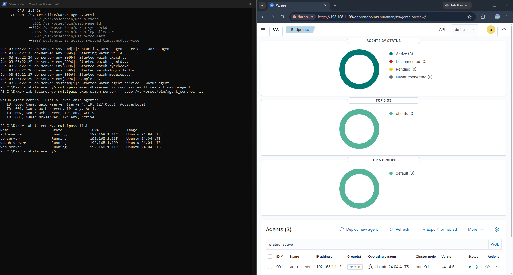
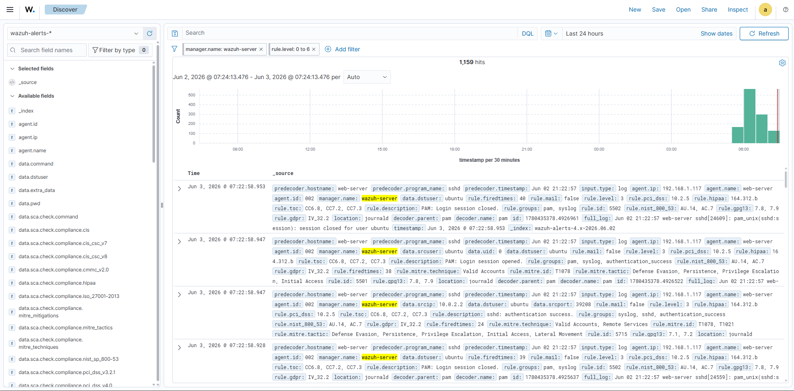
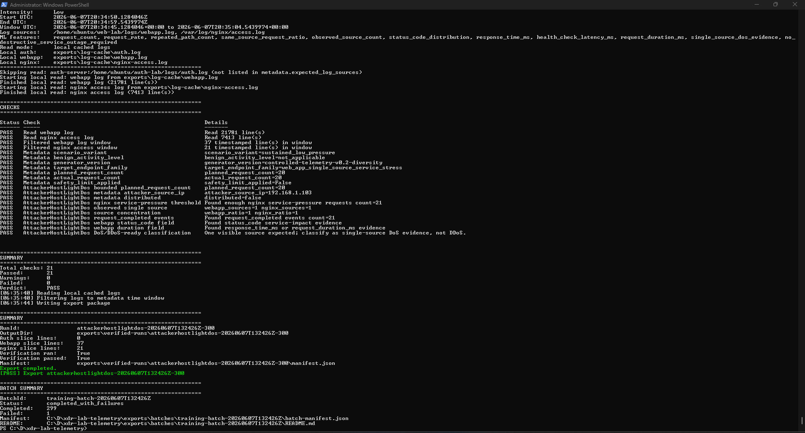
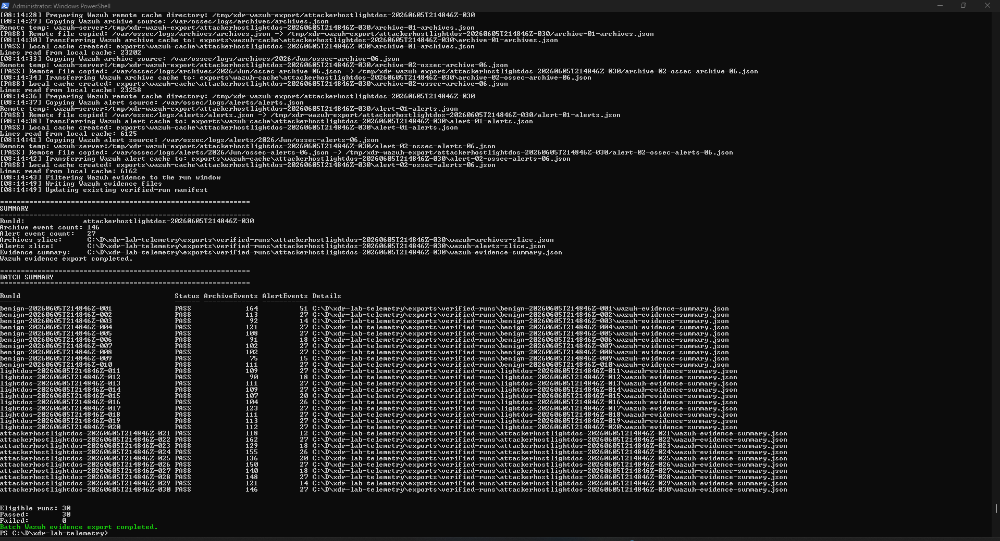
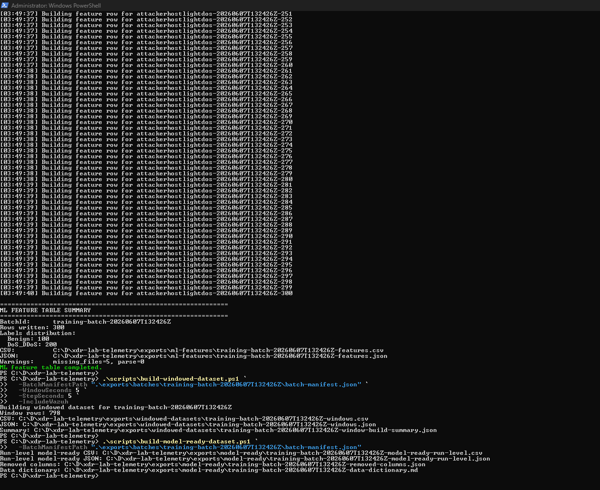
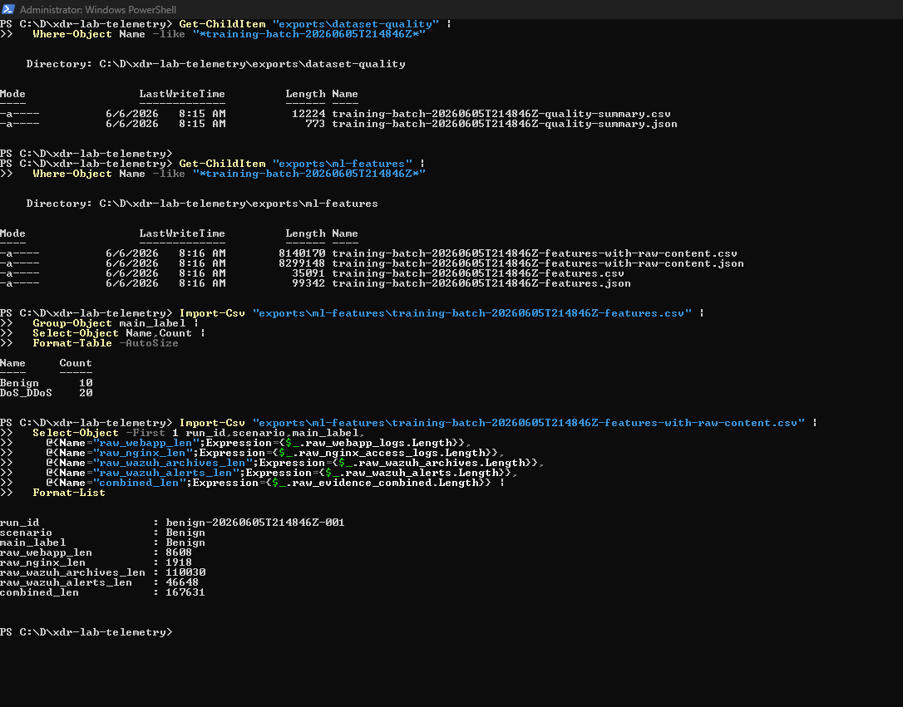

# Building a Wazuh-Linked DoS/DoS_DDoS Telemetry Dataset Lab for an Explainable XDR Prototype

**Coding Fest 2026 Technical Portfolio Report**  
**Role:** Lab and data pipeline builder  
**Project focus:** Hands-on lab build, Wazuh-linked telemetry collection, controlled DoS/DoS_DDoS dataset generation, evidence export, validation, and reproducible packaging  
**Official batch:** `training-batch-20260607T132426Z`  
**Final clean release:** `exports\dataset-releases\coding-fest-2026-xdr-dataset-training-batch-20260607T132426Z-clean.zip`

## 1. Executive Summary

This report documents my completed contribution to the Coding Fest 2026 Explainable AI-Driven XDR/SIEM lab: building and automating a controlled, Wazuh-linked telemetry dataset pipeline for application-layer DoS/service-stress research. The work produced a reproducible lab workflow that starts from controlled traffic generation, preserves raw local and Wazuh evidence, builds feature tables and windowed datasets, validates the outputs, and packages a clean portable dataset release.

The final output is a Wazuh-linked dataset package for the official batch `training-batch-20260607T132426Z`. It contains 300 tabular run-level rows, 798 windowed rows, 300 model-ready run-level rows, and 299 raw verified-run evidence folders. The raw evidence count is intentionally 299 because `benign-20260607T132426Z-043` was incomplete and excluded from raw evidence packaging. Clean supervised training should use rows where `is_clean_supervised_training_candidate == True`.

This report does not claim that final ML model training, SOC dashboard development, causal graph reasoning, or LLM SOC report generation were completed. Those are future or teammate-owned project stages. The completed contribution documented here is the lab/data-generation foundation that makes those later stages possible.

## 2. Project Scope and My Responsibility

The broader project is an incident-centric XDR/SIEM research prototype for SOC workflows. Wazuh provides the telemetry and alerting substrate, while later custom components are intended to support normalization, incident correlation, AI detection, explainability, causal reasoning, response guidance, and analyst workflow.

My completed responsibility was narrower and concrete:

- Build the local Multipass-based lab environment.
- Configure the DB/Auth/Web application stack and structured logging.
- Add Wazuh manager, dashboard, archive logging, and endpoint agents.
- Generate controlled labelled telemetry for benign and DoS/service-stress scenarios.
- Verify local evidence windows and export per-run raw evidence.
- Export Wazuh archive and alert evidence into verified-run folders.
- Build dataset quality summaries, feature tables, windowed datasets, and model-ready run-level outputs.
- Package a clean release that is portable and suitable for teammate handoff.

Out of scope for this report:

- Completed ML model training or evaluation.
- Final dashboard or production SOC case workflow.
- Implemented causal graph reasoning.
- Implemented LLM SOC report generation.
- True distributed DDoS collection with multiple visible source IPs.
- Malware/Sysmon endpoint telemetry.

## 3. My Contribution

My contribution was primarily telemetry engineering and reproducible dataset preparation. I translated the project's XDR/SIEM idea into a working evidence-generation and packaging workflow. The output is not just a set of CSV files; it is a traceable dataset package where tabular rows link back to local service logs and Wazuh-collected evidence.

Key deliverables:

| Deliverable | Completed contribution |
|---|---|
| Lab foundation | Multipass Ubuntu VMs for DB, Auth, Web, and Wazuh roles |
| App telemetry | FastAPI Auth/Web services, nginx, PostgreSQL tables, structured JSON logs |
| Wazuh linkage | Wazuh manager/indexer/dashboard, agents, archive logging, localfile collection |
| Controlled scenarios | Benign, LightDos, AttackerHostLightDos traffic with labels and metadata |
| Evidence export | Local log slices and Wazuh archive/alert slices per verified run |
| Dataset builders | Quality summary, ML feature table, windowed dataset, model-ready run-level output |
| Clean release | Portable ZIP with old evidence removed and laptop-specific paths removed |

## 4. Architecture Overview

The lab uses four Multipass Ubuntu VMs connected through bridged networking. The automation resolves current DHCP addresses dynamically rather than assuming historical IPs.

| VM | Role | Main services and evidence |
|---|---|---|
| `web-server` | Primary HTTP target | FastAPI web app, nginx reverse proxy, `/home/ubuntu/web-lab/logs/webapp.log`, `/var/log/nginx/access.log` |
| `auth-server` | Login/API evidence source | FastAPI Auth API, `/home/ubuntu/auth-lab/logs/auth.log` |
| `db-server` | Backend dependency | PostgreSQL database `xdr_lab`, tables `users`, `login_attempts`, `web_events` |
| `wazuh-server` | SIEM/XDR evidence collector | Wazuh manager, indexer, dashboard, Filebeat, archives, alerts |

The data pipeline is:

```text
Controlled scenario execution
  -> Auth/Web/nginx logs
  -> Wazuh archives and alerts
  -> local log cache
  -> verification by metadata window
  -> verified-run raw evidence folders
  -> Wazuh evidence slicing
  -> dataset quality summary
  -> ML feature table
  -> windowed dataset
  -> model-ready run-level dataset
  -> clean portable release package
```



**Figure 1 explanation:** This screenshot shows Wazuh reporting three active endpoint agents and the Multipass VM list containing `auth-server`, `db-server`, `web-server`, and `wazuh-server`. It supports the lab architecture and Wazuh agent setup sections.

## 5. Environment and Tools

| Category | Tools used |
|---|---|
| Host environment | Windows host, PowerShell automation |
| Virtualization | Multipass Ubuntu VMs with bridged DHCP networking |
| Web/application stack | FastAPI, nginx, Python virtual environments |
| Database | PostgreSQL database `xdr_lab` |
| SIEM/XDR layer | Wazuh manager, indexer, dashboard, Filebeat, endpoint agents |
| Dataset automation | PowerShell scripts under `scripts\` |
| Evidence outputs | CSV, JSON, JSONL-style Wazuh slices, log slices, Markdown summaries |

The key operational decision was to keep the lab log-centric and Wazuh-linked. Packet capture was deliberately excluded from this stage. The dataset focuses on server-side logs, web application logs, nginx logs, Wazuh archives, Wazuh alerts, and windowed behavior features.

## 6. Lab Build Process

The lab began with a Multipass DB/Auth/Web foundation. PostgreSQL was installed on `db-server`; Auth and Web services were built as FastAPI applications; nginx was configured as the public reverse proxy for the web app. The services wrote structured JSON logs so that later scripts could verify and transform the evidence reliably.

The lab then added Wazuh:

- A dedicated `wazuh-server` VM was created with enough resources for Wazuh manager, indexer, dashboard, and Filebeat.
- Wazuh agents were installed on `auth-server`, `web-server`, and `db-server`.
- Wazuh archive logging was enabled.
- Custom localfile collection was configured so Wazuh could collect application and nginx evidence.
- The dashboard and endpoint agent status were manually checked.



**Figure 2 explanation:** This screenshot shows Wazuh Discover populated with Wazuh alert records. It demonstrates that the Wazuh stack was collecting and indexing events. The visible records are mostly background authentication/system context, which is useful as SIEM evidence context but not treated as the ground-truth DoS label.

## 7. Scenario Design

The final dataset uses a binary high-level ML label:

| Scenario | Main label | Meaning |
|---|---|---|
| `Benign` | `Benign` | Normal lab activity and hard-negative benign web activity |
| `LightDos` | `DoS_DDoS` | Controlled script-generated light HTTP service-stress traffic |
| `AttackerHostLightDos` | `DoS_DDoS` | Windows-host single-source HTTP service-stress / DoS traffic |

`LightDos` and `AttackerHostLightDos` map to `DoS_DDoS`, but this must be described carefully. The current evidence is mostly controlled application-layer single-source DoS/service-stress. It is not a complete real-world DDoS benchmark, and `AttackerHostLightDos` should not be called true distributed DDoS unless victim logs show multiple visible source IPs.

The generator includes guardrails:

- DoS-style activity is bounded and rate-limited.
- The request cap is controlled by script parameters and metadata.
- Multi-source DDoS-like behavior is guarded and not used for the final official dataset.
- SQLi-style testing, when present in earlier lab work, uses safe logged strings against `/search`, not destructive exploitation.

## 8. Automation Workflow

The workflow is implemented as PowerShell scripts in `scripts\`.

| Script | Purpose |
|---|---|
| `start-and-check-lab.ps1` | Starts/checks lab VMs, resolves dynamic IPs, repairs app config targets, checks services and health endpoints |
| `generate-controlled-telemetry.ps1` | Generates labelled Benign, LightDos, AttackerHostLightDos, and other controlled lab scenario telemetry |
| `cache-lab-logs.ps1` | Transfers Auth/Web/nginx logs into `exports\log-cache` for local processing |
| `verify-log-output.ps1` | Reads run metadata and verifies expected evidence inside padded log windows |
| `export-lab-logs.ps1` | Creates per-run verified raw evidence folders under `exports\verified-runs` |
| `run-dataset-batch.ps1` | Coordinates repeated scenario runs, health checks, log caching, verification, and local evidence export |
| `sync-wazuh-agent-manager-ip.ps1` | Updates endpoint Wazuh agents when the manager IP changes |
| `export-wazuh-evidence.ps1` | Exports Wazuh archive/alert slices for one run |
| `export-wazuh-evidence-for-batch.ps1` | Original batch Wazuh exporter |
| `export-wazuh-evidence-for-batch-fast.ps1` | Fast batch exporter that caches/decompresses Wazuh sources once |
| `build-dataset-quality-summary.ps1` | Builds per-run quality and feature preview CSV/JSON |
| `build-ml-feature-table.ps1` | Builds run-level ML feature CSV/JSON, optionally with raw content |
| `build-windowed-dataset.ps1` | Builds 5-second windowed rows for timeline/stage work |
| `build-model-ready-dataset.ps1` | Builds leakage-reduced model-ready run-level dataset |

The batch runner performs this sequence for each planned run:

1. Run a lab health check unless skipped.
2. Generate one labelled telemetry run.
3. Cache local logs.
4. Verify the run using local cached logs and run metadata.
5. Export verified local evidence.
6. Continue to the next run even if one run fails, recording the result in the manifest.

## 9. Dataset Generation Process

The official final batch is:

```text
training-batch-20260607T132426Z
```

The batch manifest records:

| Parameter | Value |
|---|---|
| Scenarios | `Benign`, `LightDos`, `AttackerHostLightDos` |
| Runs per scenario | 100 |
| Total planned runs | 300 |
| Intensities | Low, Medium, High |
| Randomization | Enabled |
| Request delay | 300 ms |
| Local export padding | 5 seconds |
| Inter-run delay | 30 seconds |
| Batch status | `completed_with_failures` |

The status `completed_with_failures` is expected because one benign run, `benign-20260607T132426Z-043`, failed verification/export and was intentionally excluded from raw evidence.



**Figure 3 explanation:** This screenshot shows the official batch finishing with `Completed: 299`, `Failed: 1`, and status `completed_with_failures`. It supports the explanation for why the tabular dataset has 300 rows while the raw evidence folder contains 299 completed run folders.

## 10. Wazuh Evidence Export Process

Wazuh evidence was exported after local verified-run evidence existed. Each complete verified-run folder received:

- `wazuh-archives-slice.json`
- `wazuh-alerts-slice.json`
- `wazuh-evidence-summary.json`

The Wazuh evidence summary includes counts by agent, log location, decoder, alert rule, and other Wazuh context. This makes it possible to trace a dataset row back to both the original service log slice and Wazuh-collected/enriched evidence.



**Figure 4 explanation:** This screenshot shows Wazuh evidence export producing archive and alert counts per run. It is from a validation batch rather than the final 300-row batch, but it illustrates the same export mechanism used before the final rebuild.

### 10.1 Exporter Issue Found

During the official dataset repair phase, Wazuh evidence initially appeared to be missing for some runs. Symptoms included:

```text
No readable Wazuh archive JSON source was found
archive_event_count = 0
alert_event_count = 0
```

This was misleading. Wazuh did contain the evidence, but the exporter was not finding the correct source files and date windows.

Root causes:

| Problem | Impact |
|---|---|
| Older Wazuh archives/alerts were stored as compressed `.json.gz` files | Exporter looked mostly for active `.json` files and missed evidence |
| Wazuh top-level timestamps used local `+1000` time while run windows were UTC | Evidence for UTC 2026-06-07 runs could live in Wazuh local-date files for 2026-06-08 |

### 10.2 Exporter Fix

The Wazuh exporter was fixed to:

- Include active Wazuh files and dated archive/alert files.
- Support compressed `.json.gz` archive and alert files.
- Use remote `gzip -dc` to decompress candidate files.
- Include both UTC-date candidates and Wazuh local `+1000` date candidates.
- Normalize `+1000` timestamps to UTC.
- Filter Wazuh events into each padded run window.
- Keep output format compatible with downstream dataset builders.

The fast exporter, `export-wazuh-evidence-for-batch-fast.ps1`, was then created to avoid repeatedly copying and decompressing the same Wazuh files for every run. It caches/decompresses source files once and filters all target run windows locally.

Final Wazuh coverage check result:

| Scenario | Wazuh summary coverage |
|---|---:|
| Benign | 99 present, 1 missing known incomplete run |
| LightDos | 100 present |
| AttackerHostLightDos | 100 present |

Attack-side Wazuh evidence coverage was complete. Only `benign-20260607T132426Z-043` was missing.

## 11. Dataset Outputs

The official outputs are organized under `exports\`.

| Output folder | Purpose |
|---|---|
| `exports\batches` | Batch manifests and batch README files |
| `exports\verified-runs` | Raw local and Wazuh evidence per verified run |
| `exports\dataset-quality` | Per-run quality summary CSV/JSON |
| `exports\ml-features` | Run-level feature table CSV/JSON and raw-content variants |
| `exports\windowed-datasets` | 5-second windowed dataset CSV/JSON and build summary |
| `exports\model-ready` | Leakage-reduced run-level model-ready CSV/JSON and data dictionary |
| `exports\dataset-releases` | Final release folders and ZIP packages |

Important official files:

| File | Role |
|---|---|
| `exports\batches\training-batch-20260607T132426Z\batch-manifest.json` | Source-of-truth run manifest |
| `exports\dataset-quality\training-batch-20260607T132426Z-quality-summary.csv` | Per-run evidence and quality summary |
| `exports\ml-features\training-batch-20260607T132426Z-features.csv` | Full run-level feature table |
| `exports\ml-features\training-batch-20260607T132426Z-features-with-raw-content.csv` | Feature table with raw evidence text for audit/review |
| `exports\windowed-datasets\training-batch-20260607T132426Z-windows.csv` | 5-second windowed dataset |
| `exports\model-ready\training-batch-20260607T132426Z-model-ready-run-level.csv` | Primary leakage-reduced run-level handoff file |
| `exports\model-ready\training-batch-20260607T132426Z-data-dictionary.md` | Model-ready column dictionary |



**Figure 5 explanation:** This screenshot shows the final official batch rebuild: 300 ML feature rows, 798 windowed rows, and generation of the model-ready run-level outputs. It contains local paths, so it should be cropped if used in a public portfolio layout.

## 12. Final Clean Package

The final clean package is:

```text
exports\dataset-releases\coding-fest-2026-xdr-dataset-training-batch-20260607T132426Z-clean.zip
```

The package contains:

| Package folder | Contents |
|---|---|
| `batch-manifest` | Official batch manifest |
| `ml-features` | Feature table CSV/JSON |
| `model-ready` | Model-ready run-level dataset and data dictionary |
| `quality-summary` | Quality summary CSV/JSON |
| `windowed-dataset` | Windowed dataset CSV/JSON |
| `raw-evidence\verified-runs` | 299 complete verified-run raw evidence folders |
| `README.md` | Package notes and usage guidance |

Clean package validation:

| Check | Result |
|---|---:|
| Expected raw evidence folders | 299 |
| Actual raw evidence folders | 299 |
| Missing expected folders | 0 |
| Extra old/test folders | 0 |
| `benign-20260607T132426Z-043` raw evidence | Excluded |
| `C:\D\xdr-lab-telemetry` absolute path matches | 0 |
| `C:\\D\\xdr-lab-telemetry` escaped path matches | 0 |
| `raw-evidence\exports-original` path matches | 0 |
| Clean ZIP size | About 5.86 MB |

The first packaging attempt copied too much from `exports\verified-runs`, including old/test runs, and contained laptop-specific absolute paths. The clean release fixed this by using the official manifest as the source of truth, copying only the official complete run folders, excluding `benign-043`, and rewriting relevant paths to package-relative locations.

## 13. Reproduction Instructions

These commands are based on the actual repository scripts. They assume the lab VMs already exist and are under the user's control.

### 13.1 Start and Check the Lab

```powershell
cd "C:\D\xdr-lab-telemetry"
.\scripts\start-and-check-lab.ps1
```

Quick health check without generating a linked login test:

```powershell
.\scripts\start-and-check-lab.ps1 -SkipLinkedEvidenceTest
```

### 13.2 Synchronize Wazuh Agent Manager IP

Preview:

```powershell
.\scripts\sync-wazuh-agent-manager-ip.ps1 -WhatIf
```

Apply:

```powershell
.\scripts\sync-wazuh-agent-manager-ip.ps1
```

### 13.3 Generate a Small Scenario Run

```powershell
.\scripts\generate-controlled-telemetry.ps1 -Scenario Benign -Rounds 1
.\scripts\generate-controlled-telemetry.ps1 -Scenario LightDos -Rounds 1 -Intensity Low
.\scripts\generate-controlled-telemetry.ps1 -Scenario AttackerHostLightDos -Rounds 1 -Intensity Low -Randomize
```

### 13.4 Cache, Verify, and Export One Run

```powershell
.\scripts\cache-lab-logs.ps1
.\scripts\verify-log-output.ps1 -MetadataPath "exports\<run-id>-metadata.json" -UseLocalLogs
.\scripts\export-lab-logs.ps1 -MetadataPath "exports\<run-id>-metadata.json" -RunVerification
```

### 13.5 Run a Dataset Batch

Example small batch:

```powershell
.\scripts\run-dataset-batch.ps1 `
  -Scenarios Benign,LightDos,AttackerHostLightDos `
  -RunsPerScenario 3 `
  -Intensities Low,Medium `
  -Randomize `
  -InterRunDelaySeconds 30
```

The official 300-run batch followed the same pattern with 100 runs per scenario.

### 13.6 Export Wazuh Evidence

Original batch exporter:

```powershell
.\scripts\export-wazuh-evidence-for-batch.ps1 `
  -BatchManifestPath "exports\batches\<batch-id>\batch-manifest.json" `
  -TimePaddingSeconds 10
```

Fast exporter used for official repair/completion work:

```powershell
powershell.exe -NoProfile -ExecutionPolicy Bypass -File .\scripts\export-wazuh-evidence-for-batch-fast.ps1 `
  -BatchManifestPath .\exports\batches\training-batch-20260607T132426Z\batch-manifest.json
```

### 13.7 Build Dataset Outputs

```powershell
.\scripts\build-dataset-quality-summary.ps1 `
  -BatchManifestPath ".\exports\batches\training-batch-20260607T132426Z\batch-manifest.json"

.\scripts\build-ml-feature-table.ps1 `
  -BatchManifestPath ".\exports\batches\training-batch-20260607T132426Z\batch-manifest.json"

.\scripts\build-windowed-dataset.ps1 `
  -BatchManifestPath ".\exports\batches\training-batch-20260607T132426Z\batch-manifest.json" `
  -WindowSeconds 5 `
  -StepSeconds 5 `
  -IncludeWazuh

.\scripts\build-model-ready-dataset.ps1 `
  -BatchManifestPath ".\exports\batches\training-batch-20260607T132426Z\batch-manifest.json"
```

### 13.8 Validate Key Counts

Expected official counts:

| Output | Expected count |
|---|---:|
| Batch manifest runs | 300 |
| ML feature CSV rows | 300 |
| Windowed dataset rows | 798 |
| Model-ready run-level rows | 300 |
| Raw verified-run folders in clean release | 299 |

## 14. Problems Encountered and Fixes

| Problem | Impact | Fix or handling |
|---|---|---|
| Multipass DHCP changed VM IPs | App and Wazuh configs could point to stale addresses | Health/check scripts dynamically resolve IPs and repair configs |
| Multipass or Wazuh instability during long exports | `multipass list` hang, `wazuh-server Running N/A`, SSH timeout | Documented recovery sequence; wait for Wazuh IP and SSH before export |
| Wazuh evidence falsely appeared as zero | Archive/alert evidence missing from summaries despite existing in Wazuh | Added `.json.gz` support, local timezone date candidates, UTC conversion |
| Per-run Wazuh export was slow | Same Wazuh sources copied/decompressed repeatedly | Added fast batch exporter with one-time cache/decompression |
| First package copied old raw evidence folders | Package contained non-official test/old runs | Rebuilt package using official batch manifest as source of truth |
| First package leaked laptop-specific paths | Teammate portability risk | Rewrote package paths to package-relative locations |
| `benign-20260607T132426Z-043` incomplete | Raw evidence folder missing | Kept documented, excluded from raw evidence, marked non-clean for supervised training |
| Background Wazuh events appear in evidence windows | Wazuh summaries include journald/PAM/SSH/sudo context | Preserve provenance; do not treat Wazuh alerts as ground-truth labels |

## 15. Results and Validation

Final official validation results:

| Metric | Result |
|---|---:|
| Batch manifest runs | 300 |
| Benign run-level rows | 100 |
| DoS_DDoS run-level rows | 200 |
| ML feature rows | 300 |
| Windowed dataset rows | 798 |
| Model-ready run-level rows | 300 |
| Clean supervised candidates | 299 |
| Raw verified-run folders | 299 |
| Wazuh summaries in raw evidence | 299 |
| Total sampled Wazuh archive events across summaries | 55,508 |
| Total sampled Wazuh alert events across summaries | 8,169 |
| Clean ZIP size | About 5.86 MB |

Label distribution:

| Main label | Rows |
|---|---:|
| `Benign` | 100 |
| `DoS_DDoS` | 200 |

Scenario distribution:

| Scenario | Rows |
|---|---:|
| `Benign` | 100 |
| `LightDos` | 100 |
| `AttackerHostLightDos` | 100 |

The clean release is portable and manifest-aligned. The 300 tabular rows plus 299 raw evidence folders is expected and documented, not a packaging bug.



**Figure 6 explanation:** This screenshot shows a smaller earlier dataset feature-output validation and raw-content length checks. It is useful as process evidence showing how feature artifacts and raw evidence contents were inspected before the final official rebuild.

## 16. Known Limitations

This dataset is useful and reproducible, but it should be described honestly:

- It is controlled lab-generated data, not production traffic.
- It is log-centric and Wazuh-linked, not packet-level DDoS traffic.
- The `DoS_DDoS` class currently represents controlled application-layer DoS/service-stress.
- `AttackerHostLightDos` is single-source service-stress and should not be overclaimed as true DDoS.
- Wazuh alerts are contextual evidence, not ground-truth labels.
- Background Wazuh events such as PAM, SSH, sudo, journald, and system activity can appear in evidence windows.
- `benign-20260607T132426Z-043` is incomplete and excluded from raw evidence.
- ML model training and evaluation are outside this report.
- Final dashboard, graph reasoning, and SOC report generation are future/team stages.

## 17. Portfolio Reflection

This work strengthened my practical understanding of telemetry engineering for cybersecurity systems. The main lesson was that dataset quality depends as much on evidence handling, reproducibility, and validation as it does on traffic generation.

Key skills demonstrated:

- Building a multi-VM cybersecurity lab with Multipass.
- Configuring FastAPI, nginx, PostgreSQL, and Wazuh in a realistic evidence pipeline.
- Designing controlled benign and attack-like telemetry safely.
- Creating PowerShell automation that can be explained and rerun.
- Preserving raw evidence and provenance for later analysis.
- Debugging time-window, timezone, compression, and packaging issues.
- Producing model-ready and windowed datasets without losing traceability.
- Packaging a clean release for teammate handoff.

The strongest professional outcome is the reproducible path from controlled lab scenario to verified local evidence, Wazuh evidence, feature rows, windowed rows, model-ready rows, and a portable release ZIP.

## 18. Future Work

The following work should be treated as future direction, not completed contribution in this report:

| Future work | Purpose |
|---|---|
| ML model training and evaluation | Train baseline and improved classifiers using the model-ready dataset |
| Stage and evidence labelling | Add weak/human-reviewed labels for burst onset, sustained pressure, service stress, and evidence roles |
| True multi-source DDoS collection | Use multiple visible source IPs in victim logs before claiming distributed coverage |
| Dashboard integration | Surface incidents, evidence, and model outputs in the final SOC-facing application |
| Causal/storyline graph | Link evidence into a structured incident narrative |
| SOC report generation | Generate analyst-facing summaries after evidence and model layers are validated |
| Stronger degradation metrics | Add clearer evidence for service degradation, failed health checks, severe latency, or 5xx behavior |

## Appendix A. Selected Figure List

| Figure | Screenshot path | Recommended use | Reason |
|---:|---|---|---|
| 1 | `screenshots\Screenshot 2026-06-03 062617.png` | Include | Shows active Wazuh agents and Multipass VM topology |
| 2 | `screenshots\Screenshot 2026-06-03 072422.png` | Include/maybe | Shows Wazuh Discover populated with indexed evidence |
| 3 | `screenshots\Screenshot 2026-06-08 063608.png` | Include | Shows official batch status and 299 completed/1 failed |
| 4 | `screenshots\Screenshot 2026-06-06 081548.png` | Include/maybe | Shows Wazuh archive/alert export process and counts |
| 5 | `screenshots\Screenshot 2026-06-09 035108.png` | Include | Shows official feature, windowed, and model-ready output summaries |
| 6 | `screenshots\Screenshot 2026-06-06 082651.png` | Maybe | Shows earlier feature/raw-content validation process |

Excluded sensitive visual evidence:

- `screenshots\Screenshot 2026-06-03 060437.png` because it shows a generated Wazuh admin password.
- `screenshots\Wazuh credential.txt` because it is a credential file.

